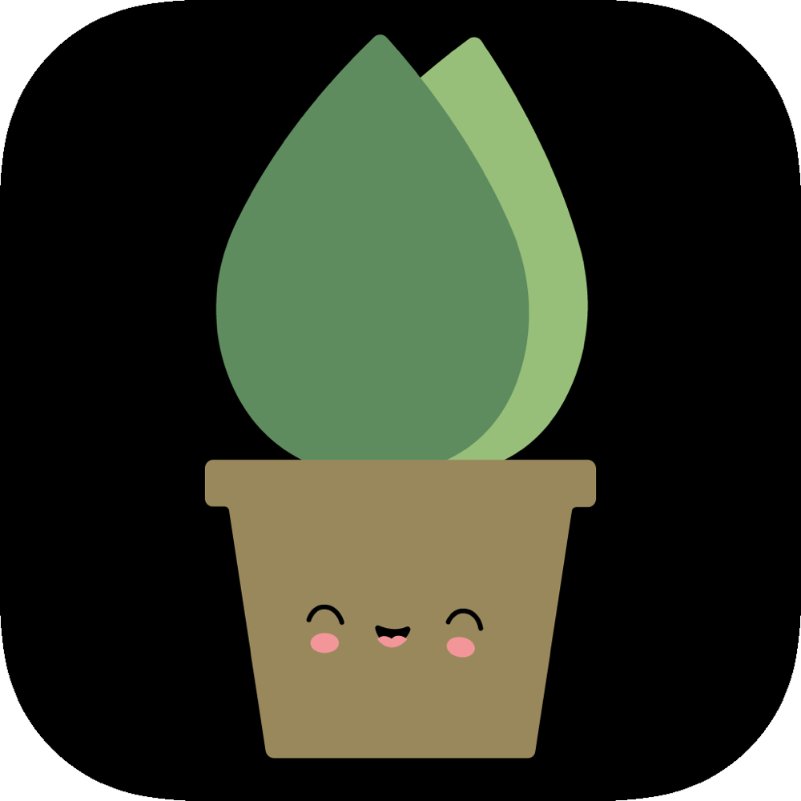
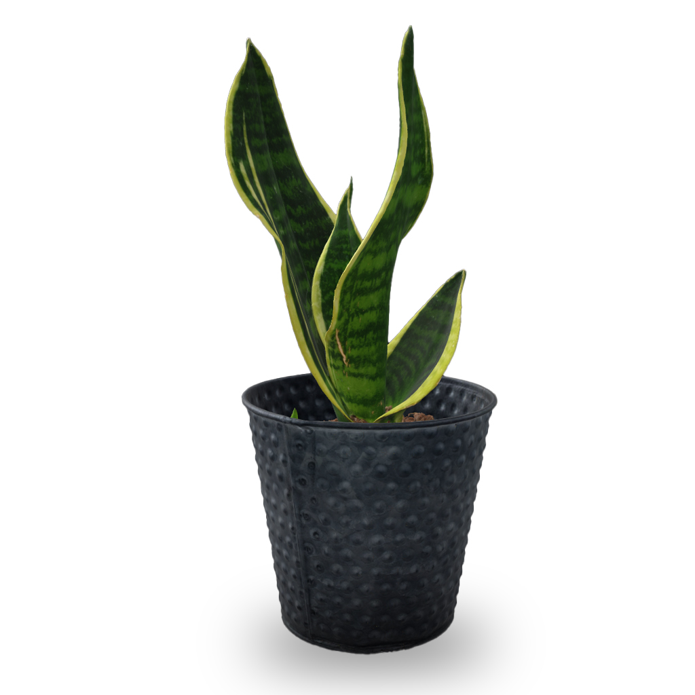

# PlantAR

 

## Table of contents
- [PlantAR](#plantar)
  - [Table of contents](#table-of-contents)
  - [Project description](#project-description)
  - [Release](#release)
  - [Usage](#usage)
  - [Screenshots](#screenshots)
  - [3D-Model](#3d-model)
  - [License](#license)

 

## Project description
PlantAR is an augmented reality app for iOS devices and was developed during an internship.

The app makes it possible to place virtual houseplants in your home in order to see whether the plants at the selected locations correspond to the user's expectations. There is also the option of changing the placement later or canceling it. The user can mark plants which he likes or uses frequently as favorites. These plants are saved in a favorites overview, but can also be removed again. With a double tap on an object that has already been placed, it can be deleted from the scene again. The user has the opportunity to take a snapshot of the surrounding with the placed objects, in order to look at them again at a later point in time. The photos are saved in the device's album. The user interface offers a button for this.

The app served primarily as the basis for a bachelor thesis. The thesis was about analyzing the functionality of the LiDAR scanner in mobile devices. It was tested which improvements in terms of performance and precision are made by the LiDAR scanner. The app was run on a device without a LiDAR scanner as well as on a device that supports LiDAR technology. The results were compared to find out how precisely the objects could be placed with and without LiDAR Technologie.

## Release

You can download the app from the App Store. 

The version in the App Store contains more 3D models. For licensing reasons these models cannot be made available in this open source project. Thats why this project includes only a single model, which is free to use.

 

## Usage
To build the app, a physical device must be connected to Xcode. Because of the AR scene, the app can not be built in the simulator.

## Screenshots
 

  
  
  

 

## 3D-Model
The 3D-Model of the Sansevieria plant was downloaded from Sketchfab.
 

[Sansevieria](https://sketchfab.com/models/2118ba211bac47d1a56c2ef5b4a645f3/embed) by [thesidekick](https://sketchfab.com/thesidekick) on [Sketchfab](https://sketchfab.com/feed)

 

## License
[GNU GPLv 3.0](https://choosealicense.com/licenses/gpl-3.0/)